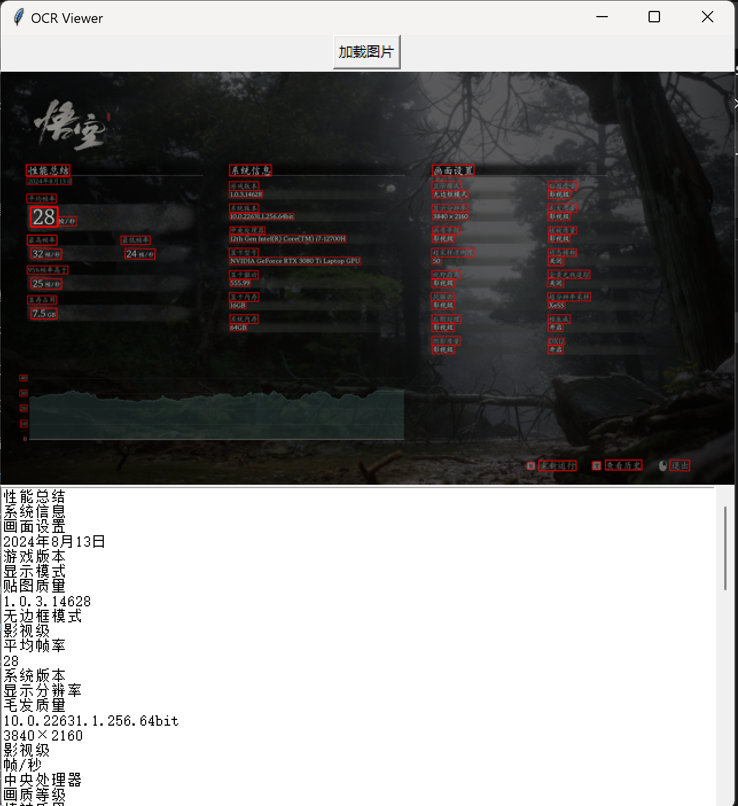

# rapidocr-windows-gui-tool
Windows下基于rapidocr的图片文字提取小工具，包含cpu版本和cuda加速的更精准版本

|version|CUDA|CPU|
|---|---|---|
|speed|(3080ti laptop) ~1s/pic|(12700h) ~1s/pic|
|rapidocr|rapidocr 2.0.2|rapidocr_onnxruntime|
|engine|torch2.6.0-cuda126|onnxruntime|
|det model|ch_PP-OCRv4_det_server_infer.pth|ch_PP-OCRv4_det_infer.onnx|
|rec model|ch_PP-OCRv4_rec_server_infer.pth|ch_PP-OCRv4_rec_infer.onnx|

- [rapidocr文档](https://rapidai.github.io/RapidOCRDocs/main/)
- [模型](https://www.modelscope.cn/models/RapidAI/RapidOCR/files)

